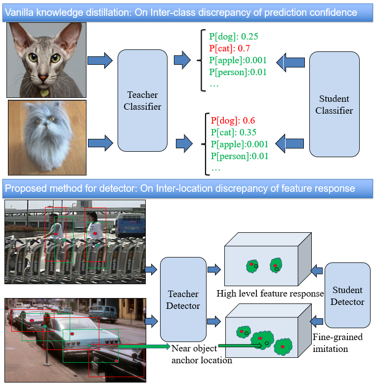
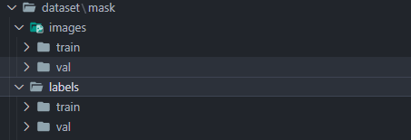
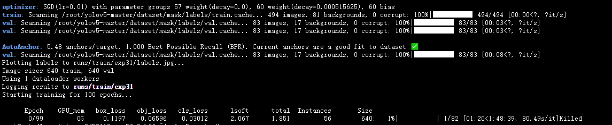

# Implementation  CVPR 2019 paper Distilling Object Detectors with Fine-grained Feature Imitation in yolov5



## Distilling Yolov5
### Preparation

#### 1 Clone the repository
First of all, clone the code
```
git clone https://github.com/xing-bing/yolov5-distilling
```

#### 2 Requirements

​     pip install -r requirements.txt

#### 3 Data preparation




### Train
```
python train_distill.py
```

​		

## Author: xingbing

## CSDN: https://blog.csdn.net/weixin_41981679/article/details/129159333

